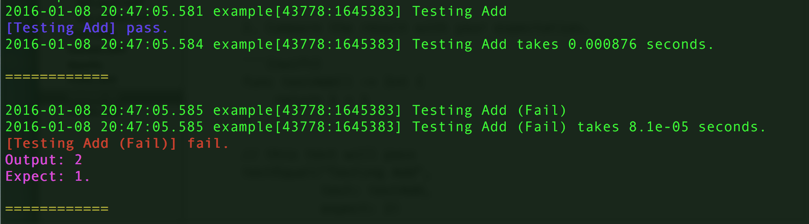

# SwiftTest - Testing in Swift Made Easy

## Basic Usage
1. Define a function which runs the code you want to test and return the result.
2. Compare the result with your expectation.

```{swift}
func testAdd() -> Int {
    return 1 + 1
}

// this test will pass
testEqual("Testing Add",
          test: testAdd,
          expect: 2)

// Not this one
testEqual("Testing Add (Fail)",
          test: testAdd.
          expect: 1)
```

If you compile above codes, you should see:



Run `make example` to see the result above.

## Testing

Run `make test`

# References

- [Profiling.swift](https://gist.github.com/pyrtsa/e1b89307c1e7b30ef841)
- [Colorful Printing](http://stackoverflow.com/questions/27807925/color-ouput-with-swift-command-line-tool)


