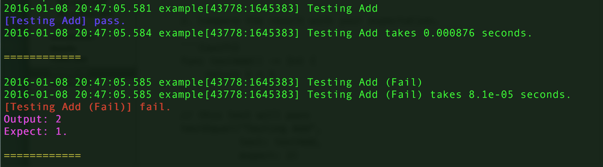
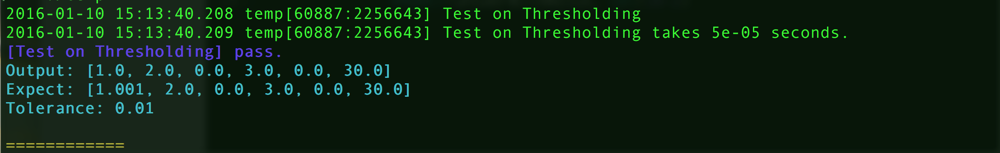

# SwiftTest - Testing in Swift Made Easy

## Basic Usage
1. Define a function which runs the code you want to test and return the result.
2. Compare the result with your expectation.

```{swift}
func testAdd() -> Int {
    return 1 + 1
}

// this test will pass
testEqual("Testing Add",
          test: testAdd,
          expect: 2)

// Not this one
testEqual("Testing Add (Fail)",
          test: testAdd.
          expect: 1)
```

If you compile above codes, you should see:



You can also test your result with tolerance:

```{swift}
func threshold(x:[Double], thres:Double) {
    var result = [Double](count:x.count, repeatedValue:0.0)

    for i in 0..<x.count {
        if x[i] > 0.0 {
            result[i] = x[i]
        }
    }
    return result
}

func testThreshold() -> [Double]{
    
    let x:[Double] = [1, 2, -1, 3, -10, 30]

    return threshold(x, thres:0.0)
}

let answerWithNoise:[Double] = [1.001, 2, 0, 3, 0, 30]

testEqualInTol("Test on Thresholding", test:testThreshold, 
               expect:answer, tol:1e-2)
```

The testing result would look like:


Run `make example` to see the result above.

## Testing

Run `make test`

# References

- [Profiling.swift](https://gist.github.com/pyrtsa/e1b89307c1e7b30ef841)
- [Colorful Printing](http://stackoverflow.com/questions/27807925/color-ouput-with-swift-command-line-tool)


